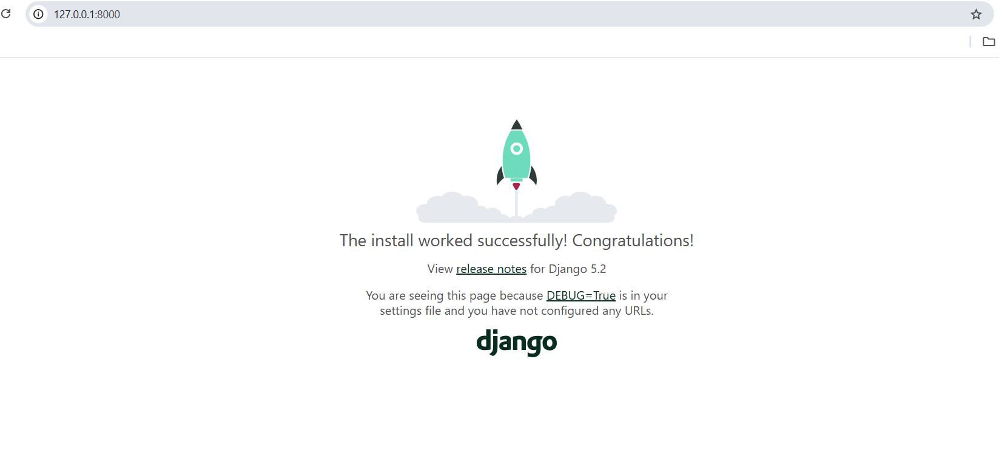

Comandos setup python

primero creacion del env (opcional)

```bash
python -m venv env
```

activar `env`

```bash
.\env\Scripts\Activate.ps1
```

instalar django

```bash
pip install django
```

comprobar que se instaló bien
```bash
django-admin --version
```

creamos estructura básica de django

```bash
django-admin startproject app .
```

arrancamos para ver que funcione

```bash
python manage.py runserver
```



conector django a postgreSQL

```bash
pip install psycopg2-binary
```


activamos migraciones

```bash
python manage.py makemigrations
python manage.py migrate
```

creamos superusuario

```bash
python manage.py createsuperuser

```


